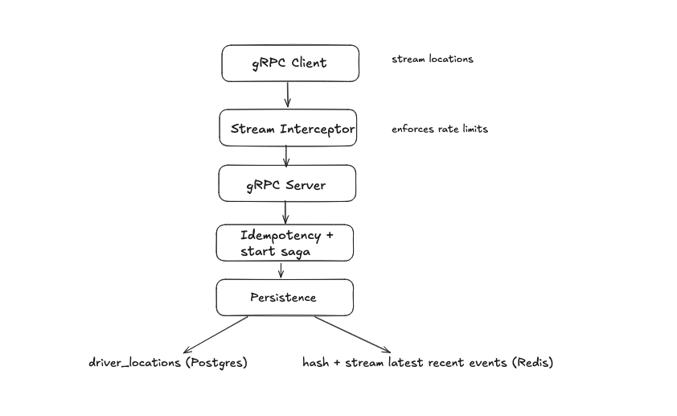
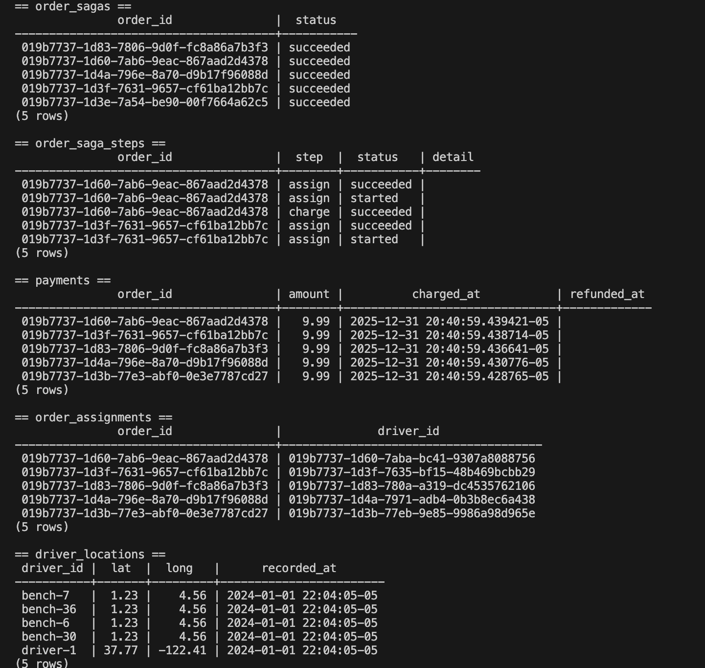
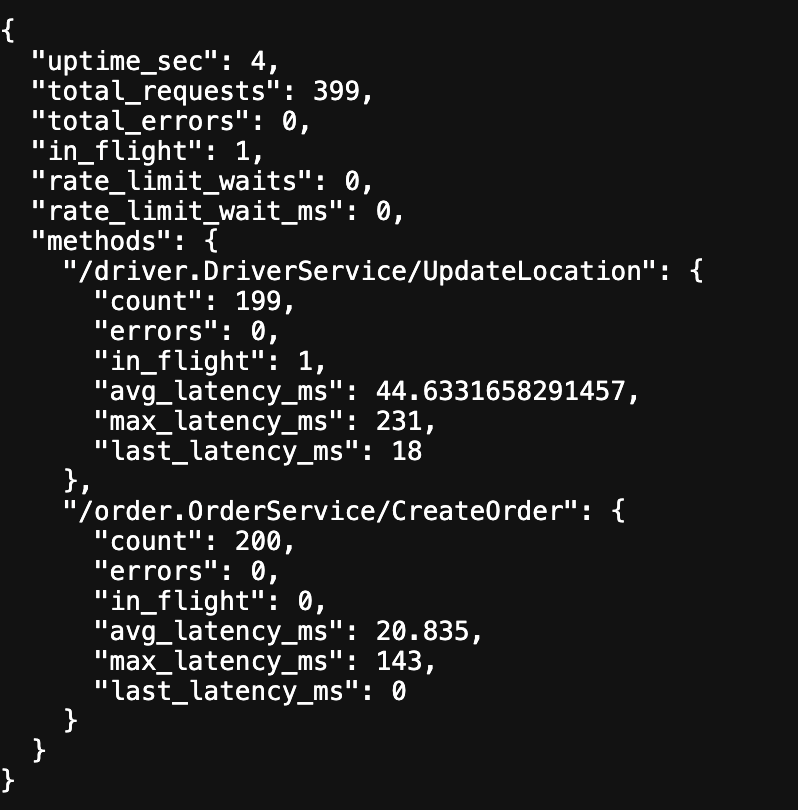

# Overview

A test-driven gRPC backend that pairs order/payment workflows with live location ingest, built with production-grade patterns. 

## Description
- Test-first discipline: every feature was driven by failing tests.
- Resilience patterns: sagas with compensation, idempotency keys, circuit breakers, ingress/egress rate limits, graceful shutdown.
- Hot/cold split: Redis for hot shared state and bounded streams; Postgres for ACID money flow and audit history.

## Architecture
- Services: a gRPC order service (creates orders, charges payments, assigns a unit) and a gRPC ingest service (streaming location updates).
- Storage split: Postgres for money flow + audit; Redis for hot state and bounded event streams.
- Order flow: 
- Location ingest: 

## Storage Map
**Postgres**
| Table              | Purpose                                                                                 |
|--------------------|-----------------------------------------------------------------------------------------|
| order_sagas        | Saga headers: order_id PK, idempotency_key, user_id, amount, status, timestamps         |
| order_saga_steps   | Per-step log with status/detail; FK to order_sagas(order_id)                            |
| payments           | One row per order: amount, charged_at, refund_amount, refunded_at                       |
| order_assignments  | Current driver assignment per order: order_id PK, driver_id, assigned_at                |
| driver_locations   | Append-only driver location history: driver_id, lat/long, recorded_at                   |

**Redis**
| Key/Stream                | Purpose                                                         |
|---------------------------|-----------------------------------------------------------------|
| Hash `driver:<id>`        | Latest location snapshot with TTL: {driver_id, lat, long, timestamp} |
| Stream `location_events`  | Recent location updates; capped length for replay/audit         |
- Storage snapshot: 

## Operations & Observability
- Reliability: retries with jitter, circuit breakers, ingress/egress rate limits, context-driven timeouts, graceful shutdown.
- Health: `/readyz` pings Redis + Postgres; gRPC health service.
- Metrics: `/metrics` JSON snapshot (per-method latency/errors/in-flight, rate-limit waits, uptime).
- Metrics snapshot: 
